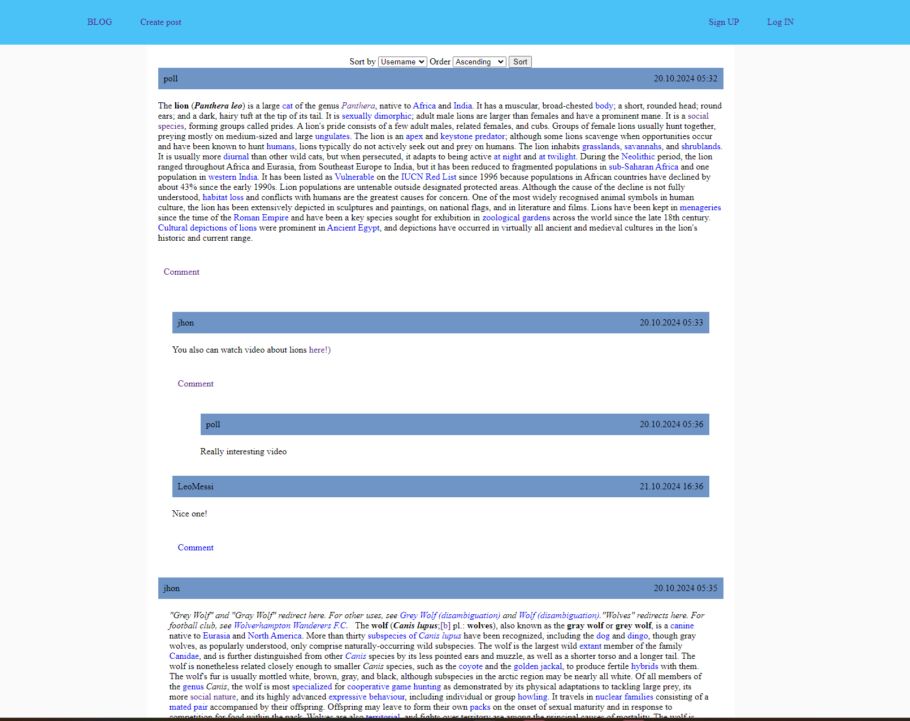

# Simple blog project

Django project for work with posts, comments and replies

## Check it out!

[Blog project deployed to Render](https://posts-and-comments.onrender.com/)

## Installation

Python3 must be already installed

```shell
git clone https://github.com/AntonSkyrda/posts-and-comments.git
cd posts-and-comments
python3 -m venv venv
source venv/bin/activate
pip install poetry
poetry install
python manage.py runserver
```

## Features

* Authentication functionality for User
* Power admin panel for managing posts, comments, replies and users
* Additional functionality for working with text and html tags

## Demo


